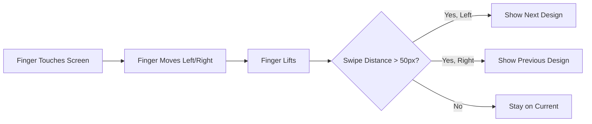

# Add Touch Swipe Navigation

## What You'll Get

Touch swipe gestures for navigating between designs on tablets and mobile devices:

- **Swipe left** → Go to next design
- **Swipe right** → Go to previous design

The swipe will feel natural and responsive, with a threshold to prevent accidental navigation from small touches.

---

## How It Works

---

## Details

| Gesture | Action |
|---------|--------|
| Swipe left (RTL) | Next design |
| Swipe right (RTL) | Previous design |
| Minimum swipe distance | 50 pixels (prevents accidental swipes) |

This works alongside the existing arrow buttons — customers can use either method to navigate.